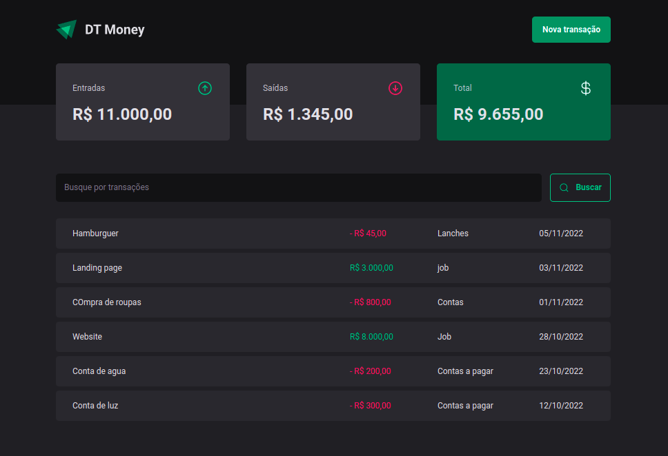
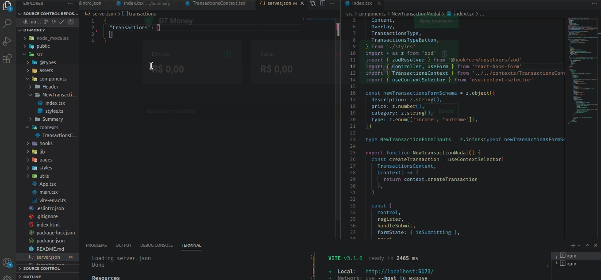
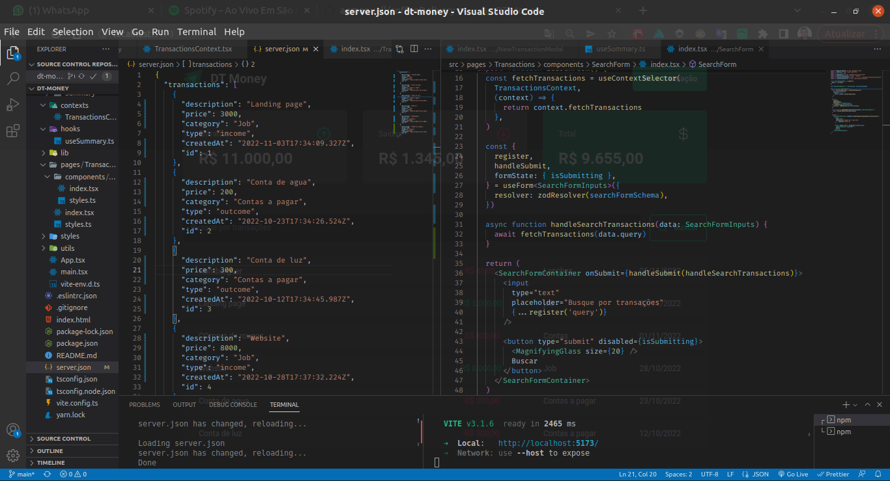

<h1 align="center"></h1>

DT Money é uma página de controle de gastos>

 <a href="#sobre">Sobre</a> •
 <a href="#experiencia">Objetivo</a> •
 <a href="#roteiro">Roteiro</a> • 
 <a href="#tecnologias">Pilha de Tecnologias</a> • 
 <a href="#autor">Autor</a>

<h4 align="center"> 
	✅  &nbsp; ▶ DT Money.
</h4>

 

### 🛠️ Para rodar o projeto

1. Realizar o clone ou o download do repositório;
2. Executar `npm install` ou `yarn install` para instalar as dependências;
3. Executar `npm run dev` ou `yarn dev` para rodar a aplicação;
3. Executar `npm json-server server.json -p 3333` para rodar o json-server;

 

  

[Visão Geral](#visao)
===================

## 🛠 [Objetivo](#objetivo)
 
  &nbsp; &nbsp; &nbsp; &nbsp; ▶ &nbsp; Este projeto trata-se de uma página de controle financeiro. O projeto foi um desafio da trilha nova de react da Rocketseat. Para este desafio, foi utilizado conceitos um pouco mais avançados em react, desenvolvendo do zero uma aplicação de sistema finanças com uma api fake. 

 

## 📝 [Roteiro](#roteiro)

 

📍 Confira nosso quadro para mais detalhes sobre o que já foi construido.
 

- [x] Componentização SearchForm
- [x] Configuração JSON Server
- [x] Requisições HTTP
- [x] Resumo de transações
- [x] Busca de transações
- [x] Criação de transações
- [x] Configurado com Axios
- [x] Utilização do React DevToos para performance
- [x] APlicação de Context Selectors
- [x] APlicação de UseMemo
- [x] APlicação de UseCallback

📌 Ainda haverá uma nova versão, confira os próximos passos.

-   [ ] próxima versão do History Timer (React, TypeScript, Javascript, Node.Js, MongoDB, API)

## ⛳ [Objetivo](#experiencia)

Este projeto é para fins de estudo, uma pequena aplicação do que aprendi em desenvolvimento web com React usando TypeScript.

    📌 TypeScript
    📌 Vite
    📌 ContextAPI
    📌 Styled Components
    📌 UseReducer
    📌 UseMemo
    📌 UseCallback
    📌 React Hook Form
    📌 useEffect, useState
    📌 Axios
    📌 ContextSelectors
    📌 React DevTools

Espero que este projeto alcance o objetivo principal que é apresentar minha experiência como Desenvolvedor front-end React com JavaScript e TypeScript

 

## 💻 [Tecnologias](#tecnologias)

 

&nbsp;&nbsp;&nbsp;&nbsp; 

&nbsp;&nbsp;&nbsp;&nbsp; 

&nbsp;&nbsp;&nbsp;&nbsp;

&nbsp;&nbsp;&nbsp;&nbsp; 

&nbsp;&nbsp;&nbsp;&nbsp; 

&nbsp;&nbsp;&nbsp;&nbsp; 

&nbsp;&nbsp;&nbsp;&nbsp; 

&nbsp;&nbsp;&nbsp;&nbsp;

&nbsp;&nbsp;&nbsp;&nbsp; 

&nbsp;&nbsp;&nbsp;&nbsp; 

&nbsp;&nbsp;&nbsp;&nbsp; 

 

## 🎬 [A seguir alguns screenshots do projeto DT Money]()

 

  <kbd>
    

    
    
    

  </kbd>

